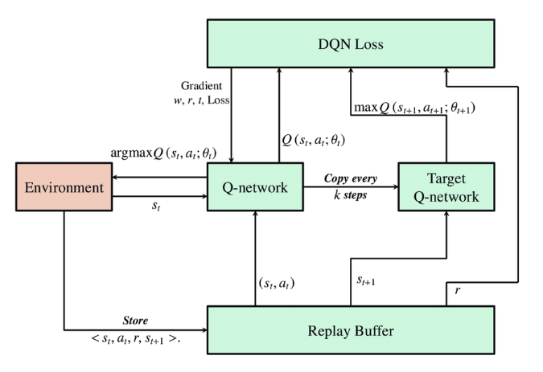
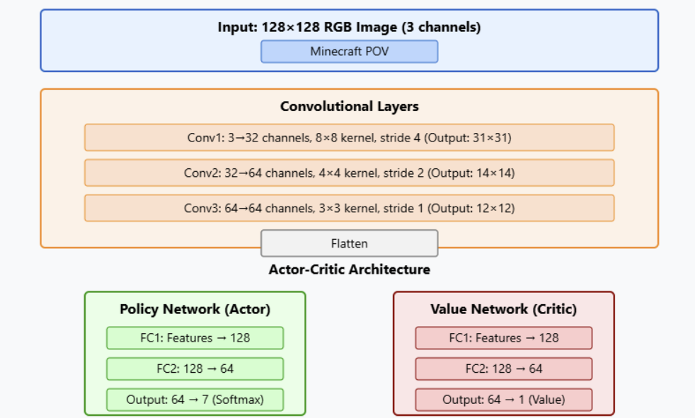

# Comparative RL Agents on MineRL: DQN vs PPO for Sparse-Reward Object Collection

A comparative study of **DQN** and **PPO** reinforcement learning agents on the [MineRL](https://minerl.io/) benchmark environment `MineRLObtainDiamondShovel-v0`. The project investigates training stability, reward shaping strategies, and algorithmic differences in a challenging sparse-reward 3D environment where agents learn to collect wood logs from pixel observations.

## Overview

| Algorithm | Implementation | Notes |
|-----------|----------------|-------|
| DQN | [`notebooks/train_dqn.ipynb`](notebooks/train_dqn.ipynb) | Custom CNN, experience replay, epsilon-greedy exploration |
| PPO | [`scripts/train_ppo.py`](scripts/train_ppo.py) | Stable-Baselines3 with simplified discrete action space |

Both agents use POV (pixel) observations resized to 64×64, a reduced action space (10 discrete actions), and custom reward shaping that rewards log collection.

## Architecture

### DQN

Experience replay with a periodically synced target network for stable Q-value learning.



### PPO

Shared CNN backbone with separate actor (policy) and critic (value) heads.



## Results

Both agents show clear learning signals over the course of training. PPO outperforms DQN in final reward, consistent with its on-policy advantage in environments with sparse rewards.

> **Note:** DQN results are logged per episode; PPO results are logged per environment step. DQN ran approximately 119,000 total steps (119 episodes × ~1,000 steps/episode), making the two runs roughly comparable in total experience.

### DQN Training Rewards

Episode reward and 10-episode moving average over 119 training episodes. The agent starts with near-zero rewards during exploration, then shows a clear learning signal after ~60 episodes as log-collection behavior emerges. Final moving average reaches ~0.08, with peak episode rewards up to ~0.16.


### PPO Training Rewards

Smoothed reward curve over ~85,000 training steps. Performance stays flat through early exploration (~55k steps), then improves steadily as the policy converges — reaching a smoothed reward of ~0.25 by the end of training.


Full write-up: [`docs/final_report.pdf`](docs/final_report.pdf)

## Project Structure

```
.
├── scripts/
│   └── train_ppo.py             # PPO training and evaluation
│   └── train_dqn.ipy            # DQN training and evaluation
├── checkpoints/
│   ├── dqn_50k/                 # DQN weights (50k timesteps)
│   └── dqn_250k/                # DQN weights (250k timesteps)
├── results/
│   ├── figures/                 # Training / evaluation plots
│   └── ppo/                     # PPO training logs
├── docs/
│   ├── diagrams/                # Model architecture diagrams
│   ├── final_report.pdf
│   └── project_proposal.pdf
├── requirements.txt
└── README.md
```

## Requirements

- Python 3.8+
- Java 8 (required by MineRL / Malmo)
- CUDA-capable GPU recommended (CPU training is supported but slow)

## Installation

```bash
git clone https://github.com/egeozgul/MineRL.git
cd MineRL

python -m venv .venv
# Windows
.venv\Scripts\activate
# Linux / macOS
source .venv/bin/activate

pip install -r requirements.txt
pip install minerl
```

> **Note:** MineRL requires additional system setup (Java, display/headless config). See the [official docs](https://minerl.io/docs/) if environment creation fails.

## Usage

### DQN

Open and run [`notebooks/train_dqn.ipynb`](notebooks/train_dqn.ipynb). Pre-trained weights are in [`checkpoints/`](checkpoints/).

### PPO

```bash
python scripts/train_ppo.py
```

| Parameter | Default | Description |
|-----------|---------|-------------|
| `TOTAL_TIMESTEPS` | 85000 | Training timesteps |
| `TOTAL_EPISODES` | 50 | Evaluation episodes after training |
| `MAX_STEPS_PER_EPISODE` | 1000 | Episode length cap |
| `SHOWFRAMES` | `False` | Save episode frames to disk |
| `LEARNING_RATE` | `1e-3` | PPO learning rate |

## Author

[Ege Ozgul](https://github.com/egeozgul)

## Citation

```bibtex
@misc{Ozgul2025minerl,
  title={Efficient Item Collection in Minecraft},
  author={Ege Ozgul},
  year={2025},
  publisher={GitHub},
  howpublished={\url{https://github.com/egeozgul/MineRL}}
}
```
